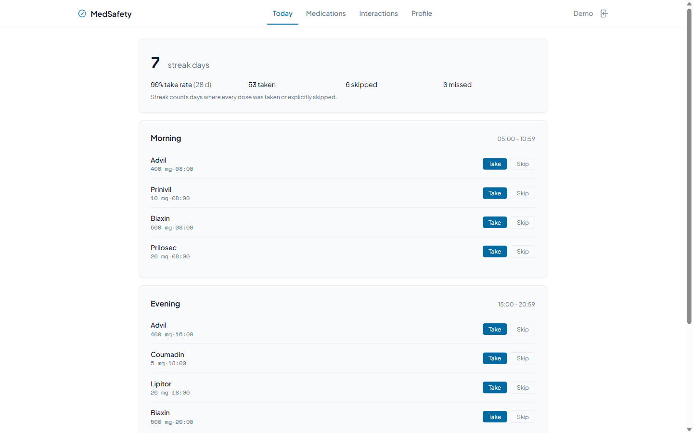

[watch demo](./medsafety.mp4)
# MedSafety

> MedSafety is a demonstration. Drug interaction data is a curated subset for
> development only and is not medical advice. Always consult a pharmacist or
> physician.

A patient who sees a cardiologist, a primary care physician, and a psychiatrist
within the same quarter typically walks out with prescriptions from three
different charts, none of which contain a complete current medication list.
MedSafety closes the patient-side gap: it maintains an active prescription
list, runs a pairwise interaction check whenever the list changes, ranks
results by clinical severity, and uses an LLM to convert each clinical
mechanism into a plain-English explanation.



## Clinical motivation

Polypharmacy is the routine background condition of adult primary care.
Roughly four in ten community-dwelling adults over sixty-five take five
or more chronic medications; among hospitalised seniors the figure
approaches two-thirds. The literature on adverse drug events in that
population is consistent across two decades: a meaningful fraction of
hospital admissions in older adults is medication-related, and a
meaningful fraction of those are preventable in the sense that a
clinician with the complete current list would have caught the
interaction.

The complete current list is the problem. Specialists prescribe from
their own charts. Pharmacy dispense records lag and miss anything paid
out of pocket. A new prescriber sees what the patient remembers in the
intake form. The patient-side gap is real, and it widens every time the
patient changes one of their prescribers.

MedSafety does not try to solve clinical decision support. It builds the
artifact upstream of clinical decision support that is almost always
missing: an active medication list maintained by the patient, with a
visible pairwise interaction matrix that updates whenever the list does.
Severity is ranked along the conventional four-level scale
(contraindicated, major, moderate, minor) against a curated subset of
225 documented pairs across fifty common drugs.

## Who this is for

- **Polypharmacy patients**, particularly older adults managing chronic
  cardiovascular, metabolic, psychiatric, or pain conditions across two
  or more prescribers.
- **Caregivers and adult children** maintaining a parent's medication
  list between physician visits.
- **Pharmacy and medical students** as a teaching scaffold for the
  pairwise-interaction reasoning pattern.

Not for: emergency clinical use, prescribing decisions, replacing a
pharmacist consultation. The interaction database is a curated subset
sized for a demonstration, not the full clinical reference. Every page
of the application repeats this; the README repeats it twice; the
README in this section repeats it a third time. Always consult a
pharmacist or physician.

## What you do in the app

1. Add the drugs you actually take, with dose and schedule.
2. The interaction matrix recomputes and highlights anything ranked
   moderate or higher.
3. Tap an interaction to see a one-paragraph plain-English explanation
   of the mechanism, generated by an LLM and grounded in the curated
   pair record.
4. Take or skip each scheduled dose. The adherence streak and the
   28-day take rate appear on the today page.

The application is fully functional offline and with no API keys: the
LLM explainer falls back to a hand-written template per severity bucket,
and the seed database covers all of the demonstration scenarios.

## Single-tenant by design

There are no accounts, no registration, no login. One instance is one
patient (or one caregiver maintaining a parent's list). The URL is the
secret. Run it on a private host, share the link with the people who
need it. To reset, delete the `data` folder.

## Run

```
docker compose up --build -d
```

Open <http://localhost:8004>. On first boot a single patient row is
created together with a small demonstration prescription list.

## What's in scope

- My medications: list, add, edit, stop.
- Interaction matrix: pairwise check across the active list, severity-ranked,
  with LLM mechanism explainer.
- Daily reminders: schedule expansion, take/skip, adherence streak.

## AI features

MedSafety uses an LLM in two places. Both share the same provider
chain (OpenRouter -> Anthropic -> local template) and remain functional
with no API keys. No clinical advice is generated; the model is asked
only to translate curated facts into patient-facing English, and every
response is paired with a reminder to consult a pharmacist.

- **Interaction explainer.** On the Interactions tab each pair has an
  Explain button that calls
  `POST /api/me/interactions/<id>/explain`. The backend feeds the
  curated severity and mechanism into the model and asks for a
  two-paragraph patient-friendly explanation: what happens in the
  body when these two are combined, and what symptoms to watch for
  versus when to call a doctor. Results are cached per pair and a
  Refresh action regenerates them.
- **Ask about a medicine.** The Ask tab takes a single drug from the
  catalog plus a plain-English question
  (`POST /api/drugs/<id>/ask`). The model replies in two or three
  short sentences plus the pharmacist-reminder closer. The UI offers
  three preset questions (caffeine interaction, morning vs evening,
  what to do on a missed dose) and a free-form input capped at 240
  characters. The local fallback returns a structured "ask your
  pharmacist" template that names the drug class so the answer is
  still useful offline.

## API

| Method | Path                                          |
|--------|-----------------------------------------------|
| GET    | `/api/drugs/search?q=`                        |
| GET    | `/api/drugs/<id>`                             |
| POST   | `/api/drugs/<id>/ask`                         |
| GET    | `/api/me/prescriptions?active=`               |
| POST   | `/api/me/prescriptions`                       |
| PATCH  | `/api/me/prescriptions/<id>`                  |
| DELETE | `/api/me/prescriptions/<id>`                  |
| GET    | `/api/me/interactions`                        |
| POST   | `/api/me/interactions/<id>/explain?refresh=`  |
| GET    | `/api/me/reminders?date=YYYY-MM-DD`           |
| POST   | `/api/me/reminders/<id>/taken`                |
| POST   | `/api/me/reminders/<id>/skip`                 |
| GET    | `/api/me/adherence?days=30`                   |
| GET    | `/api/health`                                 |

## Configuration

| Variable             | Default                                      |
|----------------------|----------------------------------------------|
| `OPENROUTER_API_KEY` | empty -> skipped                             |
| `OPENROUTER_MODEL`   | `meta-llama/llama-3.3-70b-instruct:free`     |
| `ANTHROPIC_API_KEY`  | empty -> skipped                             |
| `ANTHROPIC_MODEL`    | `claude-haiku-4-5`                           |
| `DB_PATH`            | `/app/data/medsafety.db`                     |
| `RXNORM_BASE_URL`    | `https://rxnav.nlm.nih.gov/REST/`            |
| `RXNORM_TIMEOUT_S`   | `4`                                          |
| `AI_TIMEOUT_S`       | `12`                                         |

## Layout

```
medsafety/
  app/                 Flask blueprints, models, seed, AI client, RxNorm client
  static/              index.html, app.js, styles.css
  data/                SQLite volume, gitignored
  wsgi.py              gunicorn entry
  requirements.txt
  Dockerfile
  docker-compose.yml
  .env.example
  README.md
```

## Stack

- Backend: Python 3.12, Flask 3, SQLAlchemy 2, gunicorn gthread 2x4.
- Persistence: SQLite at `data/medsafety.db`.
- Frontend: Vue 3 ESM from CDN, Tailwind play CDN. No build step.
- LLM: OpenRouter -> Anthropic -> local template fallback.
- HTTP client: stdlib `urllib.request` only.

## Local dev (without Docker)

```
cd medsafety
python -m venv .venv
. .venv/Scripts/Activate.ps1
pip install -r requirements.txt
flask --app wsgi run --port 8004 --no-debugger
```

## Reset

```
docker compose down -v
rm -rf data
```

## Out of scope

- SMS, push, or email notifications. Reminders are display-only.
- Real prescriber, pharmacy, or EHR sync.
- Allergy tracking.
- Condition / diagnosis tracking, ICD codes.
- Insurance, formulary, refill, or pharmacy-pickup tracking.
- Multi-language UI.
- Dark theme.
- Per-day customised schedules.
- A real medication interaction database.
- Multi-user / accounts. By design.

## License

MIT.
